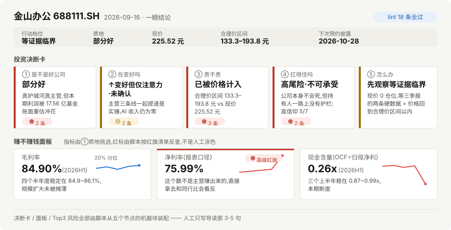

# YEZHI Company Analysis

**在 Claude Code 里输入一个公司名，得到一份能直接读的投资分析报告。**

它会自己去拉财报数据、下载并精读年报原文、跑完会计审计框架，然后把结论收敛成一张五行决断卡：
**是不是好公司 / 在变好吗 / 贵不贵 / 扛得住吗 / 现在该怎么办**。

支持 A 股 / 美股 / 港股。报告全程说人话，每个关键数字都能回到出处。

<p align="center">
  <a href="https://github.com/leafpaper/claude-company-analysis/actions/workflows/tests.yml"></a>
  
  
  
  
  
</p>

<p align="center">
  <picture>
    <source media="(prefers-color-scheme: dark)" srcset="./assets/readme/hero-dark.svg">
    
  </picture>
</p>

<p align="center"><sub>报告首页(示意图,数据取自 <a href="https://leafpaper.github.io/Inves-Report/reports/688111_金山办公/分析报告_dashboard.html">金山办公 688111</a> 的真实分析)</sub></p>

---

## 先看成品

说明书不如实物。四份真实报告，点开就能读：

| 公司 | 结论 | 这份报告在讲什么 |
|---|---|---|
| [金山办公 688111](https://leafpaper.github.io/Inves-Report/reports/688111_金山办公/分析报告_dashboard.html) | 先观察等证据临界 · 0 仓位 | 净利润同比 +237%，但其中 17.56 亿是两只关联方基金的账面重估，连扣非口径都挡不住 |
| [华特气体 688268](https://leafpaper.github.io/Inves-Report/reports/688268_华特气体/分析报告_dashboard.html) | 回避 | 增长是真的，但要先分清有多少来自涨价、多少来自放量 |
| [中际旭创 300308](https://leafpaper.github.io/Inves-Report/reports/300308_中际旭创/分析报告_dashboard.html) | 回避 | 利润率顶格，护城河却建在外采芯片上 |
| [东山精密 002384](https://leafpaper.github.io/Inves-Report/reports/002384_东山精密/分析报告_dashboard.html) | 先观察等证据临界 · 0 仓位 | 卡位是真的，但股价早已付完账 |
| [PCB ↔ 光模块 产业链对比](https://leafpaper.github.io/Inves-Report/compare/pcb-optics/) | 钱两家都不放 | 同一条链的两端，分散不了同一个风险 |

全部报告：[leafpaper.github.io/Inves-Report](https://leafpaper.github.io/Inves-Report)

---

## 它能做什么

**一、把一家公司从头看到尾**（`/company-analysis 金山办公`）

- 拉齐结构化数据：三表、财务指标、股东、限售解禁、资金流、同业对标
- **下载年报/季报 PDF 并精读原文**，不依赖第三方摘要；关键结论带 `[PDF:2025年报, P.45]` 这样的出处
- 跑 11 个会计审计框架（Piotroski / Beneish / Altman / 杜邦 / Sloan 应计 / 治理 / 关联方…）机械扫雷
- 估值做三件套：股价拆成「已赚到的 + 为想象多付的」、反向 DCF 推出现价在赌什么、分业务各算各的
- 产出一份 HTML 报告：首页决断卡 + 五章正文 + 附录 A-E（完整表格全部下沉附录）

**二、财报季只重评变化的部分**（`--review`）

质地默认复用，只有四条机检触发才重评；状态/赔率/路径/决策每次必重评。成本约全量的三分之一，
首页多一块「较上版变化」，第一句直接回答「结论变了没」。

**三、同行之间只选一家**（`--compare`）

上半部分把各家的决断卡并排搬过来（零新判断），下半部分回答「这组里钱该放哪家」——
只引用各家报告里已有的证据，不现场编新的。

### 它不做什么

- **不打分**。没有综合评分、权重、修正系数——v8 已经把评分机制整个删掉了，因为一个分数会把所有分歧抹平。
- **不替你下单**，也不做量化回测。它给的是判断和该等什么事件，不是交易信号。
- **不保证结论正确**。它保证的是：每个数字有出处、每个结论有证据、机器能查出来的自相矛盾一条都不放过。

---

## 投资理念

**先弄清「是不是一家好公司」，再决定「现在这个价格该不该买」——这是两件事，绝不能混。**

判断一家公司值不值得投，只问五个问题，按固定顺序：

| | 问题 | 怎么答 |
|---|---|---|
| ① 质地 | 是不是好公司 | 生意模式赚不赚钱、赚的钱是真的吗、护城河在不在、管理层可信吗、财务底子稳吗 |
| ② 状态 | 在变好吗 | 只认实锤（财报、订单、官方披露），传闻一律打折；并给出**该等什么**——具体到哪份报告、哪个数字过哪条线 |
| ③ 赔率 | 贵不贵 | 把股价拆成「已经赚到的」+「为未来想象多付的」。想象占比越大，越是"必须做到"，做不到就杀估值 |
| ④ 路径 | 扛得住吗 | 方向对、中途腰斩你拿不住，照样亏。先量最坏能跌到哪，再决定下不下注 |
| ⑤ 决策 | 现在该怎么办 | 把②③④的判定相乘取档位，给仓位、给该等什么、给什么情况下认错 |

三件事里有任何一件是"差"，现在就不是好下注。**好公司 ≠ 现在能买**，决断卡把这两件事分开告诉你。

方法内核来自「贝叶斯之美」五篇（《投资是泊松过程》《喊线时代》《三大数学模型之美》《信仰投资最大陷阱》《十年十倍股》）。
框架只是内部的思考引擎，报告正文不出现裸术语。完整定义见 [`references/judgment-chain.md`](./references/judgment-chain.md)。

---

## 报告长什么样

| 部分 | 内容 |
|---|---|
| **首页** | 决断卡五行 + 赚不赚钱面板（3-5 个指标带走势图与红标）+ Top3 风险 + 3-5 句导读 |
| **① 质地** | 五个子判定 ✓ / ⚠️ / ✗，每个给最硬的一两条证据 |
| **② 状态** | 实锤 vs 传闻分级、故事四关、**临界点（该等什么，全报告唯一出处）** |
| **③ 赔率** | 合理价区间 [低端, 高端] + 三种估值方法的完整推导（十条算术闭合机检） |
| **④ 路径** | 左尾清单（每条量到价格）、高信仰体检、**证伪 / 退出清单** |
| **⑤ 怎么办** | 行动档位 + 仓位（全报告唯一出处）+ 该等什么 + 什么情况下我错了 |
| **附录 A-E** | A 财务明细 / B 同业对标 / C 舆情资金与技术面 / D 红旗总清单 / E 数据来源与信息缺口 |

首页、附录、Top3 全部由脚本从五个节点的机器块装配，**人工只写导读那 3-5 句**。

---

## 怎么保证它不糊弄你

这是这个项目花力气最多的地方。三道关，一道比一道贵：

**1. 机器门控 `lint_v8`（18 条规则，不过就不许出片）**

举几条实际拦下来过的：

- **R3 数字唯一出处**——同一个数字只能有一个家，异地出现必须带出处
- **R7 封顶**——有致命红旗时，行动档位强制回避，写手改不了
- **R8 越权发声**——仓位和买卖建议只能出现在⑤，其余章节提一句都会被拦
- **R13 / R15 / R16 跨节点同源**——⑤抄的退出线必须在④里找得到，三元组必须与②③④逐字相同，抄的价格区间必须与③当前的一致
- **R18 红旗清单同步**——审计重跑后忘了刷新红旗清单，写手就会引不到 id；成品看不出来，但这条规则看得出来

**2. 两个 LLM reviewer 并行评审 + 修正循环（最多三轮）**

一个只查判断链逻辑（引用有没有变成重推、最硬证据是不是真硬），一个只查可读性与交付（结论先不先行、术语有没有说人话、390px 手机上读不读得下去）。它们开的每条 FIX 会被分诊回对应的写手或主 agent。

**3. 524 个单元测试**

每个被真实报告打出来的缺陷，都会变成一条回归测试。

---

## 快速开始

### 开始之前

| 要求 | 说明 |
|---|---|
| **Claude Code** | 这是一个 Claude Code 的 skill，不是网页版 Claude 或独立命令行程序。装好后在 Claude Code 对话里用 |
| **Python 3.11+** | 数据层跑在本地 Python，不占用模型上下文 |
| **Tushare token** | 分析 A 股 / 港股必需；只分析美股可以不配 |
| **一次全量要多久** | 本机实测约 2 小时（采集 5 分钟 → 精读 20 分钟 → 判断链三波 25 分钟 → 质量环每轮约 10 分钟，最多三轮）。`--review` 约三分之一 |
| **要花多少 token** | 主要成本在 10 个 sub-agent 的并行写作与三轮评审，量级在百万 token。想省就少跑几轮质量环——但那正是这套东西值钱的地方 |

### 1. 装 skill

```bash
# Mac / Linux
curl -fsSL https://raw.githubusercontent.com/leafpaper/claude-company-analysis/main/install.sh | bash
```
```powershell
# Windows(在克隆下来的仓库根目录里跑)
powershell -ExecutionPolicy Bypass -File .\install.ps1
```

装到 `~/.claude/skills/company-analysis/`，10 个 sub-agent 装到 `~/.claude/agents/company-analysis/`。
**装完要重启 Claude Code**，sub-agent 名册才会生效。

### 2. 装 Python 依赖

```bash
pip3 install --user -r ~/.claude/skills/company-analysis/scripts/requirements.txt
```

依赖：`tushare yfinance pypdf pandas pyarrow requests markdown pyyaml jsonschema`

### 3. 配 Tushare token（分析 A 股 / 港股必需）

去 [tushare.pro](https://tushare.pro/register) 注册拿 token。学生认证可拿 5000+ 免费积分；
或充 2000 积分（约 ¥200）解锁全部核心财报接口。

```bash
# Mac / Linux
echo 'export TUSHARE_TOKEN="your_token"' >> ~/.zshrc && source ~/.zshrc
```
```powershell
# Windows,重开终端生效
[Environment]::SetEnvironmentVariable('TUSHARE_TOKEN','your_token','User')
```

> token 走环境变量，别提交进 git。[`.env.sample`](./.env.sample) 是模板。

### 4. 自检并开跑

```bash
cd ~/.claude/skills/company-analysis && python3 -m scripts.check_env
```

全部 `[OK]` 就可以在 Claude Code 对话里跑了：

```
/company-analysis 贵州茅台              # 全量分析，不给代码也行
/company-analysis 贵州茅台 --review     # 财报季增量复查
/company-analysis 东山精密 --compare    # 同行对比
```

自然语言同样触发：「复查一下茅台」「和同行比比」。

---

## 一次分析产出什么

```
output/{公司名}/
├── manifest.json              # 公司级状态（历次 run / 增量计数 / 预约披露日）
├── raw_data/                  # parquet 结构化数据 + 下载的 PDF + 段落抽取结果
├── data_snapshot.md           # 9 节确定性数据
├── audit_report.md / .json    # 11 框架审计
├── red_flags.json             # 红旗清单（稳定 id，写手引用 + 附录D 的源）
├── peer_analysis.md / capital_flow.md / technical_analysis.md
├── phase1-data.md / phase2-documents.md
└── runs/{日期}/
    ├── nodes/node-*.md        # 五个判断节点
    ├── assembly/assembly.json # 装配产物
    ├── reviewer_responses/    # 三轮评审往返记录
    ├── {公司}-analysis-{日期}.md
    └── {公司}-analysis-{日期}.html   # 最终成品
```

报告 HTML 发布到姊妹仓库 [leafpaper/Inves-Report](https://github.com/leafpaper/Inves-Report)，由 GitHub Pages 托管。

---

## 流水线

```
Phase 1  采集      data-collector：结构化数据 + PDF 下载解析 + 11 框架审计 + 红旗清单
Phase 2  精读      doc-analyst：读 PDF 原文，产出带页码引用的文档精析
Phase 3  判断链    第一波  ①质地 ∥ ③赔率
                   第二波  ④路径 ∥ ②状态     （④的左尾深度要用③的价格区间当分母）
                   第三波  ⑤决策             （吃前四个节点的机器块）
                   装配    首页 + 五章 + 附录A-E
Phase 6  质量环    lint_v8 18 条 → reviewer-logic ∥ reviewer-delivery → 修正循环 → 出片发布
```

波次由 `scripts/node_graph.py` 按依赖图算出来，不是写死的；增量复查用同一套调度跑任意节点子集。
写手只读「判断链手册 + 自己那一份节点手册」，跨节点只允许引用对方的判定，不许重新推导。

---

## 仓库结构

| 目录 | 放什么 |
|---|---|
| [`SKILL.md`](./SKILL.md) | 主 agent 的调度说明书 |
| [`agents/`](./agents/) | 10 个 sub-agent 定义：采集 / 精读 / 四个节点写手 / 决策 / 两个 reviewer / 对比裁决 |
| [`references/`](./references/) | [判断链手册](./references/judgment-chain.md) + 四份节点手册 + HTML 规范 |
| [`phases/`](./phases/) | 各阶段执行细则（判断链写作、质量环发布、增量复查、产业链对比） |
| [`scripts/`](./scripts/) | 33 个 Python 脚本：数据采集 / 审计 / 装配 / 15 份 JSON Schema / lint / 出片 |
| [`scripts/tests/`](./scripts/tests/) | 524 个单元测试 |
| [`assets/html/`](./assets/html/) | 报告与对比页的 HTML / CSS 模板 |
| [`.scratch/`](./.scratch/) | v8 重构期的设计留档与实现票（为什么这么改，都记在里面）——不参与运行 |

---

## 版本

完整记录见 [CHANGELOG.md](./CHANGELOG.md)。

| 版本 | 关键变化 |
|---|---|
| **v8.10** | 首个轻资产订阅制样本（金山办公）打出 5 个采集缺陷 + 6 条流水线修补：PDF 把交叉引用当正文、新红旗「投资收益占营业利润过高」、合同负债藏在其他非流动负债里、lint 新增 R18、附录C 不再替⑤发号施令 |
| **v8.9** | R17 已兑现倍数不超增长退出；技术面并入附录C；红旗 id 归一化（数据刷新不再制造假变化） |
| **v8.5** | 首页判断卡嵌套链接被浏览器拆成九张（线上报告实测）；R15 三元组同源 / R16 价格区间引用过期 |
| **v8.3** | 产业链对比 `--compare`：并排决断卡 + 组内裁决 |
| **v8.1** | 增量复查 `--review`：分层重评，成本约全量三分之一 |
| **v8.0** | 判断链收敛：9 章 → 首页 + 五章 + 附录；删除全部评分机制；首页与附录改为机器装配 |

---

## 免责声明

**本项目是研究工具，不是投资建议。**

它输出的判定、行动档位与仓位，是一套公开方法在公开数据上的推演结果，**不构成任何证券的买卖建议**。
报告里的数字来自 Tushare / yfinance 与上市公司公开披露，可能存在采集口径差异、数据滞后或抽取错误；
由大模型生成的判断同样可能出错——报告里所有「信息缺口」与「降级标注」就是为了让你看见它哪里没把握。

**据此做出的任何投资决策，风险由你自己承担。** 真要下注之前，请自己回原始公告核对一遍。

数据来源：[Tushare Pro](https://tushare.pro)（A 股 / 港股，需自备 token 并遵守其服务条款）、
[yfinance](https://github.com/ranaroussi/yfinance)（美股）、交易所公开披露的定期报告 PDF。

---

## 贡献

欢迎 issue / PR。重点方向：更多审计框架、更多市场（日股 / 欧股）、机构持仓数据源。

改代码前先跑一遍测试：

```bash
python -m unittest discover -s scripts/tests -t .
```

> 每个被真实报告打出来的缺陷都应该留下一条回归测试——这个仓库里绝大多数测试都是这么来的。

**License**: [MIT](./LICENSE) · **作者**: [@leafpaper](https://github.com/leafpaper) ·
**思路借鉴**: [terancejiang/Turtle_investment_framework](https://github.com/terancejiang/Turtle_investment_framework)
